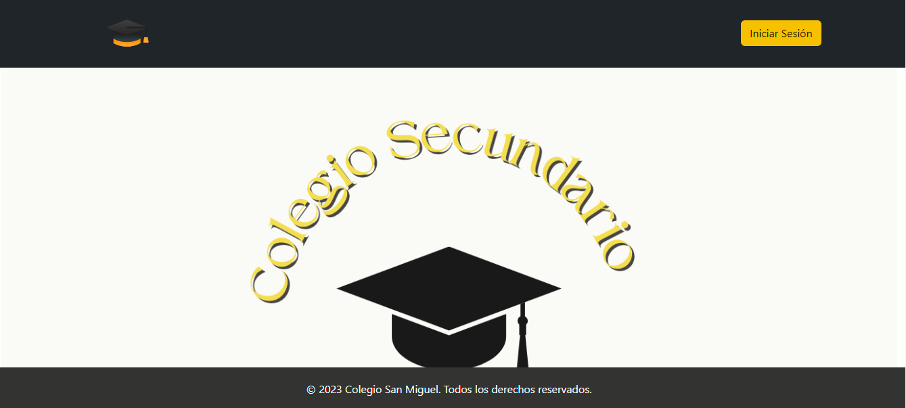

# Escuela - Control de asistencia
Trabajo universitario de desarrollo web creado con Flask. Las intrucciones están explicadas en el archivo PracticoUnidad5.pdf del mismo repositorio 

## Usuarios logueados

* Preceptor:
  * email: anaestrada@gmail.com
  * contraseña: anaestrada
  * rol: preceptor

* Padre:
  * email: rodalb@gmail.com
  * contraseña: rodalb@gmail.com
  * rol: padre
  * dni hijo: 54001789

## Capturas de la páginas

## Tecnologías Utilizadas

